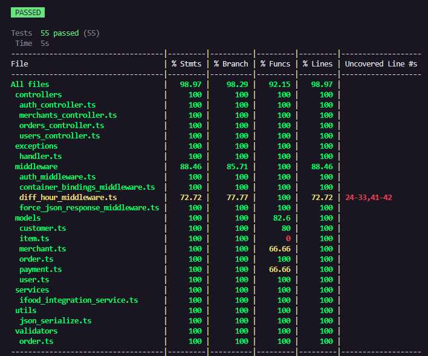

---
# You can also start simply with 'default'
theme: dracula
# random image from a curated Unsplash collection by Anthony
# like them? see https://unsplash.com/collections/94734566/slidev
# some information about your slides (markdown enabled)
title: Testes Automatizados
info: |
  ## Entendendo testes automatizados
# apply unocss classes to the current slide
class: text-center
# https://sli.dev/features/drawing
drawings:
  persist: false
# slide transition: https://sli.dev/guide/animations.html#slide-transitions
transition: slide-left
# enable MDC Syntax: https://sli.dev/features/mdc
mdc: true
layout: quote
---

# Entendendo Testes Automatizados

---

## Tipos de Testes
<br>

- **Testes Unitários**: Focados em testar unidades isoladas de código.
- **Testes de Integração**: Verificam a interação entre diferentes módulos.
- **Testes End-to-End (E2E)**: Testam a aplicação como um todo, do início ao fim.

---

### Exemplo de Teste Unitário
<br>
  
- Testam componentes ou funções isoladamente.
- Garantem que uma unidade de código funcione como esperado.

<br>

```js
// Exemplo de teste unitário usando Jest
import { sum } from './math.js';

test('adds 1 + 2 to equal 3', () => {
  expect(sum(1, 2)).toBe(3);
});
```
---

### Exemplo de Teste de Integração
<br>

- Testam a interação entre múltiplos componentes ou módulos.
- Verificam se as partes do sistema funcionam em conjunto.

<br>

```js
// Exemplo de teste de integração
import { fetchData } from './api.js';

test('fetches data successfully', async () => {
  const data = await fetchData();
  expect(data).toHaveProperty('items');
});
```
---

### Exemplo de Teste E2E (End-to-End)
<br>

- Testam o fluxo completo de uma aplicação.
- Simulam a interação do usuário com o sistema.

<br>

```js
// Exemplo de teste E2E usando Cypress
describe('Login flow', () => {
  it('should login successfully', () => {
    cy.visit('/login');
    cy.get('input[name=username]').type('user');
    cy.get('input[name=password]').type('password');
    cy.get('button[type=submit]').click();
    cy.url().should('include', '/dashboard');
  });
});
```

---

## Pirâmide ou Troféu de Testes?
<br>

### Pirâmide de Testes
<br>

- Mais testes unitários, menos testes E2E.
- Foco em testes rápidos e baratos.

<br>

### Troféu de Testes
<br>

- Enfatiza a importância dos testes de integração.
- Mais testes de integração e E2E para validar a interação entre componentes.

---

## Conceito AAA (Arrange, Act, Assert)

### AAA em Testes
<br>

- **Arrange**: Configura o estado inicial do teste. (Preparar)
- **Act**: Executa a ação ou comportamento que você está testando. (Executar)
- **Assert**: Verifica se o resultado é o esperado. (Validar)

<br>

```js
// Exemplo do conceito AAA
import { sum } from './math.js';

test('adds 1 + 2 to equal 3', () => {
  // Arrange
  const a = 1;
  const b = 2;

  // Act
  const result = sum(a, b);

  // Assert
  expect(result).toBe(3);
});
```
---

# Dominando Conceitos de Testes

### Mocks

- Substituem dependências reais por versões controladas.
- Úteis para testar comportamento dependente de serviços externos.

<br>

```js
// Exemplo de Mock
import { fetchData } from './api.js';
import { fetchMock } from 'jest-fetch-mock';

fetchMock.enableMocks();

beforeEach(() => {
  fetchMock.resetMocks();
});

test('fetches data successfully with mock', async () => {
  fetchMock.mockResponseOnce(JSON.stringify({ items: ['item1', 'item2'] }));
  const data = await fetchData();
  expect(data.items).toEqual(['item1', 'item2']);
});
```
---

# Dominando Conceitos de Testes


### Stubs

- Fornecem implementações específicas para testes.
- Controlam o comportamento de dependências para verificar diferentes cenários.

<br>

```js
// Exemplo de Stub
const getUser = jest.fn(() => ({
  name: 'John Doe',
  age: 30,
}));

test('returns user details', () => {
  const user = getUser();
  expect(user.name).toBe('John Doe');
});
```
---


# Dominando Conceitos de Testes


### Spies

- Monitoram chamadas de funções para validar comportamento.
- Útil para verificar quantas vezes uma função foi chamada e com quais argumentos.

<br>

```js
// Exemplo de Spy
import { logger } from './logger.js';

test('calls logger with correct message', () => {
  const spy = jest.spyOn(logger, 'log');
  logger.log('Test message');
  expect(spy).toHaveBeenCalledWith('Test message');
});

```
---

# FakeTimers
- Simulam o comportamento do temporizador para testar código assíncrono.

<br>

```js
// Exemplo de FakeTimers
jest.useFakeTimers();

test('delays execution by 1 second', () => {
  const callback = jest.fn();
  setTimeout(callback, 1000);

  jest.advanceTimersByTime(1000);
  expect(callback).toHaveBeenCalled();
});
```

---

# Code Coverage (Cobertura de Testes)

- Mede a quantidade de código coberta por testes.
- Ajuda a identificar áreas não testadas do código.
<div style="display: flex; gap: 0.5rem; align-items: center; justify-content: center; margin-top: 2rem;">
  
  
</div>

---

# Práticas de Testes Automatizados

### Test Driven Development (TDD)

<br>

- Escreva o teste antes do código.
- Refatore o código apenas após o teste passar.

<br>

```js
// Exemplo de TDD
test('new user has no orders', () => {
  const user = new User();
  expect(user.orders).toHaveLength(0);
});

// Código implementado após o teste falhar
class User {
  constructor() {
    this.orders = [];
  }
}
```

---

# Behavior Driven Development (BDD)

- Foca no comportamento do sistema em linguagem natural.
- Usa Given-When-Then para descrever cenários de teste.


### Feature: User orders

```gherkin
Feature: User orders management

  Scenario: New user should have no orders
    Given a new user
    When I check the user's orders
    Then the user should have no orders
```

### Código para Implementação

```js {*}{maxHeight:'175px'}
// user.feature.js
import { Given, When, Then } from '@cucumber/cucumber';
import { expect } from 'chai';

class User {
  constructor() {
    this.orders = [];
  }
}

Given('a new user', function () {
  this.user = new User();
});

When('I check the user\'s orders', function () {
  this.orders = this.user.orders;
});

Then('the user should have no orders', function () {
  expect(this.orders).to.have.lengthOf(0);
});

```
---